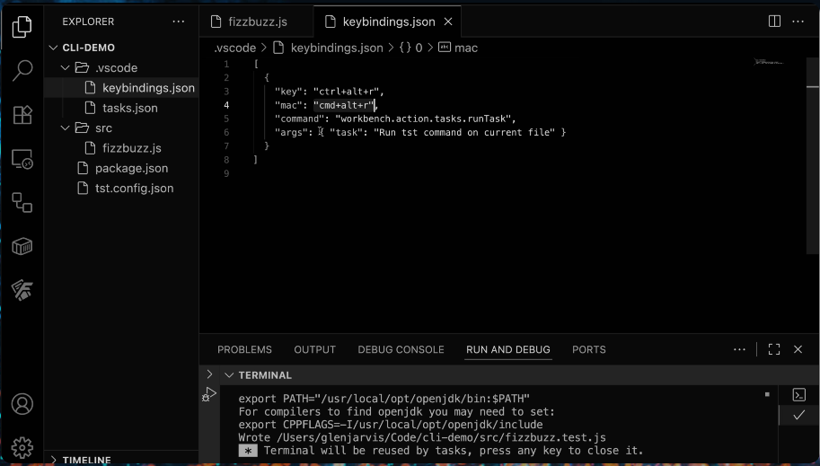

<div align="center">
 
  <!--h1>TST Studio.</!--h1-->
  <!-- Badges -->
<p>
  <a href="https://github.com/TST-Studio/tst-cli/graphs/contributors">
    
  </a>
  <a href="">
    
  </a>
  <a href="https://github.com/TST-Studio/tst-cli/network/members">
    
  </a>
  <a href="https://github.com/TST-Studio/tst-cli/stargazers">
    
  </a>
  <a href="https://github.com/TST-Studio/tst-cli/issues">
    
  </a>
  <a href="https://github.com/TST-Studio/tst-cli/blob/main/LICENSE">
    
  </a>
</p>

<h4>
    <a href="https://tst-studio.com/">View Demo</a>
  <span> · </span>
    <a href="https://github.com/TST-Studio/tst-cli">Documentation</a>
  <span> · </span>
    <a href="https://github.com/TST-Studio/tst-cli/issues/">Report Bug</a>
  <span> · </span>
    <a href="https://github.com/TST-Studio/tst-cli/issues/">Request Feature</a>
  </h4>

</div>

<!-- About the Project -->

## About the Project

`tst` is a tool from TST-Studio that **automatically generates unit tests for TypeScript code**, helping developers maintain flow, reduce boilerplate, and improve test coverage.  
Built with **TypeScript, Vitest, OCLIF, ts-morph, and LLMs (like OpenAI, Claude, etc)**.

<div align="center"> 
  
</div>

## Example

#### Math.ts

```ts
export function add(a: number, b: number): number {
  return a + b;
}
```

#### Generated test (math.test.ts):

```ts
import { describe, it, expect } from 'vitest';
import { add } from './math';

describe('add', () => {
  it('adds two numbers', () => {
    expect(add(2, 3)).toBe(5);
  });
});
```

<!-- Table of Contents -->

### Table of Contents

- [About the Project](#about-the-project)
  - [Tech Stack](#tech-stack)
  - [Features](#features)
  - [Environmental Variables](#environment-variables)

- [Getting Started](#getting-started)
  - [Prerequisites](#prerequisites)
  - [Installation](#installation)
  - [Running Tests](#running-tests)
- [Commands](#commands)
- [Generate](#generate)
- [Auth](#auth)
- [Roadmap](#roadmap)
- [License](#license)

<!-- TechStack -->

### Tech Stack

- **Language:** TypeScript
- **Test Runner:** Vitest
- **CLI Framework:** OCLIF
- **LLM Integration:** OpenAI
- **AST Parsing:** ts-morph

<!-- Features -->

### Features

- Generate unit tests automatically from source files
- Output structured, runnable Vitest test files
- Update existing test cases as code evolves
- AI-assisted edge case suggestions
- CLI interface for smooth developer workflow

---

## Getting Started

### Prerequisites

Ensure you have the following installed:

- [Node.js v18+](https://nodejs.org/)
- [npm](https://www.npmjs.com/)

### Tech Stack

- **Language:**
  - [TypeScript](https://www.typescriptlang.org/)

- **CLI Framework:**
  - [OCLIF (@oclif/core)](https://oclif.io/)

- **Parsing & Utilities:**
  - [ts-morph](https://ts-morph.com/) – TypeScript AST parsing
  - [globby](https://github.com/sindresorhus/globby) – File globbing
  - [fs-extra](https://github.com/jprichardson/node-fs-extra) – Extended file system utilities
  - [chalk](https://github.com/chalk/chalk) – Terminal styling
  - [zod](https://zod.dev/) – Schema validation
  - [dotenv](https://github.com/motdotla/dotenv) – Environment variable management

- **Developer Tooling:**
  - [ESLint](https://eslint.org/) + [Prettier](https://prettier.io/) – Code linting and formatting
  - [Husky](https://typicode.github.io/husky) – Git hooks (e.g., lint on commit)
  - [tsx](https://tsx.is/) – Run TypeScript directly in dev mode
  - [TypeScript (tsc)](https://www.typescriptlang.org/docs/handbook/compiler-options.html) – Compiler
  - [@types/node](https://github.com/DefinitelyTyped/DefinitelyTyped/tree/master/types/node) – Node.js type definitions

- **OCLIF Support:**
  - [oclif](https://oclif.io/) – CLI scaffolding and packaging
  - [@oclif/plugin-legacy](https://github.com/oclif/plugin-legacy) – Legacy command support
  - `oclif.manifest.json` – Generated CLI manifest

### Installation

```bash
$ npm install -g @tst-studio/tst
```

---

### Configuration

Add `tst.config.json` configuration file:

```bash
$ tst configure --outFormat=sameLocation
Wrote tst.config.json
```

---

### Usage

#### Generate tests for a file

```bash
tst generate ./src/queue.js
```

This will submit the whole file to the LLM and create a test file in the appropriate location.

#### Generate tests for a specific function

```bash
tst generate ./src/queue.js --function=enqueue
```

Only the `enqueue` function is sent to the LLM for test generation.

---

## Output Location

You can control where test files are generated using the `outFormat` option in `tst.config.json`.

- **sameLocation**

  ```bash
  tst generate ./src/queue.js --outFormat=sameLocation
  ```

  Produces: `./src/queue.test.js`

- **testDir**
  ```bash
  tst generate ./src/queue.js --outFormat=testDir --outBaseSrc=./src --outBaseTest=./tests
  ```
  Produces: `./tests/queue.test.js`

---

## Configuration

`tst` expects a configuration file in your project root:

`tst.config.json`

Example:

```json
{
  "provider": "openai",
  "model": "gpt-4o-mini",
  "outFormat": "testDir",
  "outBaseSrc": "./src",
  "outBaseTest": "./tests",
  "astLibrary": "ts-morph",
  "testingFramework": "vitest",
  "moduleType": "module"
}
```

### Fields

- **provider**: `"openai"` (future: `"anthropic"`, `"vertex"`, `"azure-openai"`, `"bedrock"`, etc.)
- **model**: `"gpt-4o-mini"` (future: `"gpt-4o"`, `"gpt-4.1"`, `"gpt-4.1-mini"`)
- **outFormat**: `"sameLocation" | "testDir"`
- **outBaseSrc**: Root including `src` (used when `outFormat` is `testDir`)
- **outBaseTest**: Root including `tests` (used when `outFormat` is `testDir`)
- **astLibrary**: `"ts-morph"` (future: `"babel"`)
- **testingFramework**: `"vitest"` (future: `"jest"`, etc.)
- **moduleType**: `"module"` (future: `"commonjs"`, etc.)

---

## Commands

### Configure

```bash
tst configure
```

Generates `tst.config.json`. You can also specify fields via flags:

```bash
tst configure --provider=openai --model=gpt-4o-mini --outFormat=testDir --outBaseSrc=./src --outBaseTest=./tests --astLibrary=ts-morph --testingFramework=vitest --moduleType=module
```

## Generate

```bash
tst generate ./src/utils/math.js                  # Generate unit tests for an entire file
tst generate ./src/utils/math.js --function=add   # Generate unit tests for a specific function

```

## Auth

```bash
tst auth set --provider=openai --api-key=$OPENAI_API_KEY
  # Store API key for a specific provider
tst auth status
  # Show current authentication status
```

### Discovery

```bash
tst providers list                 # List all available providers
tst models list--provider=openai   # List models for a specific provider (e.g., OpenAI)
tst config show                    # Display current configuration
tst doctor                         # Run diagnostics to check environment and setup
```

### Other Commands

```bash
tst --help      # Display available commands and usage
tst --version   # Show the current CLI version
```

---

## Environment Variables

```bash
export OPENAI_API_KEY=sk-...
```

The API key is required to communicate with the LLM.

---

## Roadmap

- **Provider Support:** Add integration for `anthropic`, `vertex`, `azure-openai`, and `bedrock`
- **Alternative AST parsers:** Explore alternative parsers such as `babel`
- **Testing Frameworks:** Extend support beyond Vitest ( e.g. `jest`)
- **Module type options:** Add configuration options for (`commonjs`)
- **CI integration modes:** - Provide modes for seamless CI/CD workflows

---

## License

MIT (c) [TST-Studio](https://github.com/TST-Studio)
